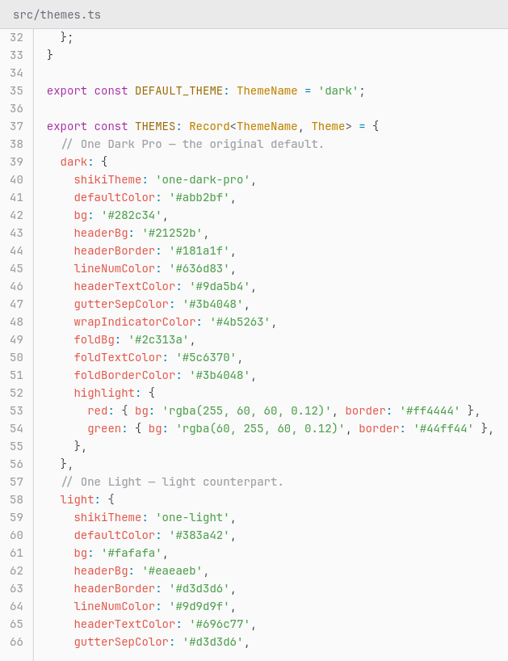
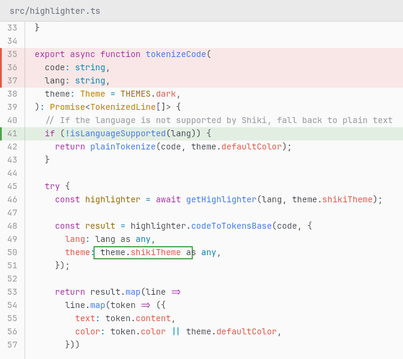
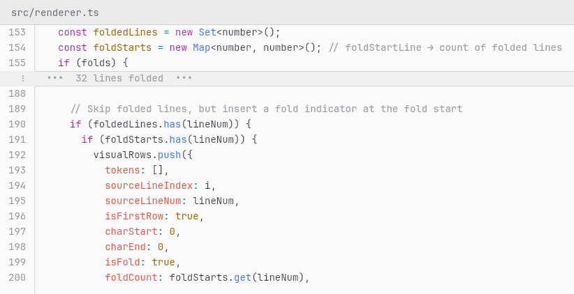

<h1 align="center">snipshot</h1>

<p align="center">
  <a href="https://www.npmjs.com/package/snipshot"></a>
  <a href="https://github.com/n8tz/snipshot/blob/master/LICENSE"></a>
  <a href="https://www.npmjs.com/package/snipshot"></a>
</p>

---
<p align="center">
  <strong>Generate beautiful PNG screenshots of code snippets from the command line.</strong><br>
  Syntax highlighting, line numbers, and colored annotations — no browser required.
</p>

---

<p align="center">
  
</p>

---

## Features

- **Syntax highlighting** for 200+ languages via [Shiki](https://shiki.style) (VS Code-quality tokenization)
- **Line numbers** with proper gutter alignment
- **Red/green highlights** — full lines or precise column ranges
- **Fold/collapse** line ranges to hide boilerplate with `--fold`
- **Context lines** — 3 lines around your selection by default (`--context` / `--no-context`)
- **Page-fit guard** — errors past 70 rendered rows so snippets fit on a page (`--max-lines` / `--no-max-lines`)
- **Page-width word wrap** — long lines wrap to fit a document by default (`--max-width` / `--no-max-width`)
- **Automatic language detection** from 150+ file extensions, with graceful plaintext fallback for unknown types
- **Dark & light themes** — One Dark Pro (default) or One Light via `--theme`
- **Offline** — everything runs locally, no network needed
- **Standalone binaries** for Linux, Windows, and macOS (via Bun compile)

## Install

```bash
# npm (requires Node.js >= 18)
npm install -g snipshot

# or run directly
npx snipshot <file> --lines <range>
```

## Usage

```bash
snipshot <file> --lines <start>-<end> [options]
```

### Options

| Option | Description |
|---|---|
| `--lines <range>` | Line range to capture, e.g. `42-56` **(required)** |
| `--highlight-red <specs>` | Red highlights — comma-separated and/or repeatable |
| `--highlight-green <specs>` | Green highlights — comma-separated and/or repeatable |
| `--fold <ranges>` | Collapse line ranges into a single indicator row — comma-separated and/or repeatable |
| `--context <n>` | Lines of context before/after `--lines`, clamped to the file (default: `3`) |
| `--no-context` | Show exactly the requested lines |
| `--max-lines <n>` | Error if the result exceeds this many rows so it fits a page (default: `70`) |
| `--no-max-lines` | Disable the rows limit |
| `--theme <name>` | Color theme: `dark` (default) or `light` |
| `--max-width <pixels>` | Max image width with word wrap (default: `800` ≈ a page width) |
| `--no-max-width` | Disable word wrap (image grows to the longest line) |
| `--output <path>` | Output file path (default: `<name>_L<start>-<end>.png`) |
| `--root <path>` | Project root for the header path (default: nearest `.git` above the file, else the current directory) |

Running `snipshot` with no arguments prints this help.

### Highlight / fold format

Each `--highlight-*` and `--fold` flag takes one or more comma-separated targets (and can be repeated):

```
47           # entire line 47
47-50        # lines 47 through 50
47:12-38     # line 47, columns 12 to 38 (highlights only — draws a box)
13,15-18     # several at once in a single flag
```

All numbers are 1-based and inclusive.

### Examples

```bash
# Basic screenshot (3 context lines added automatically)
snipshot src/App.java --lines 42-56

# Multiple highlights in one flag
snipshot src/App.java --lines 42-56 --highlight-red 47,50-52 --highlight-green 55:12-38

# Wider lines (override the default page-width wrap), or disable wrapping
snipshot src/App.java --lines 1-20 --max-width 1100
snipshot src/App.java --lines 1-20 --no-max-width

# Fold boilerplate to focus on what matters
snipshot src/App.java --lines 1-80 --fold 5-30,60-70

# Exactly the requested lines, no context
snipshot src/App.java --lines 42-56 --no-context

# Large extract that exceeds the 70-row page-fit limit
snipshot src/App.java --lines 1-200 --no-max-lines

# Light theme
snipshot src/App.java --lines 42-56 --theme light

# Custom output path
snipshot src/App.java --lines 42-56 --output screenshot.png
```

## Examples

**TypeScript with interface highlight and column annotation:**

<p align="center">
  
</p>

**Long lines wrapped to a fixed width, with mixed highlights:**

<p align="center">
  
</p>

**Clean output without highlights:**

<p align="center">
  
</p>

### Light theme (`--theme light`)

**Syntax highlighting:**

<p align="center">
  
</p>

**Red/green annotations:**

<p align="center">
  
</p>

**Folded region:**

<p align="center">
  
</p>

## Standalone binaries

Pre-built binaries include the Bun runtime — no Node.js installation needed on the target machine.

### Download

Grab the archive for your platform from [Releases](../../releases), extract it, and run:

```bash
./snipshot src/App.java --lines 10-30
```

### Build from source

Requires [Bun](https://bun.sh):

```bash
# All platforms (linux, win, mac-intel, mac-arm)
npm run build:standalone

# Specific platform
npm run build:standalone:linux
npm run build:standalone:win
npm run build:standalone:mac-intel
npm run build:standalone:mac-arm
npm run build:standalone:mac      # both macOS arches

# Or call the script directly (also supports comma-separated platforms)
node scripts/build-standalone.mjs linux,win
```

Each platform builds to its own folder — `standalone/<os>/snipshot` (or `snipshot.exe` on Windows):

```
standalone/
├── linux/snipshot
├── win/snipshot.exe
├── mac-intel/snipshot
└── mac-arm/snipshot
```

Every binary is a single self-contained file.

**Install system-wide (Linux/macOS):**

```bash
sudo cp standalone/linux/snipshot /opt/snipshot
sudo ln -s /opt/snipshot /usr/local/bin/snipshot
```

## How it works

1. Reads the **full source file** (not just the requested lines) to ensure accurate syntax highlighting
2. Tokenizes with [Shiki](https://shiki.style) using the One Dark Pro theme (or One Light with `--theme light`)
3. Renders to a canvas with [@napi-rs/canvas](https://github.com/nickel-rs/canvas) (Skia-based, no browser needed)
4. Exports as PNG

The font used is [JetBrains Mono](https://www.jetbrains.com/lp/mono/) (bundled).

## Development

```bash
git clone https://github.com/n8tz/snipshot.git
cd snipshot
npm install

npm run build        # compile TypeScript
npm test             # run tests (34 tests)
npm run test:watch   # watch mode
```

## License

MIT
